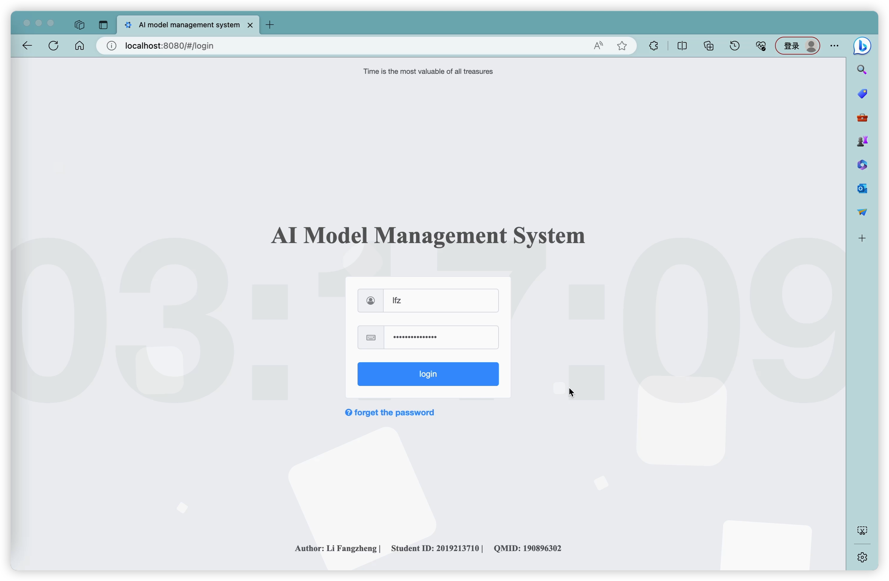
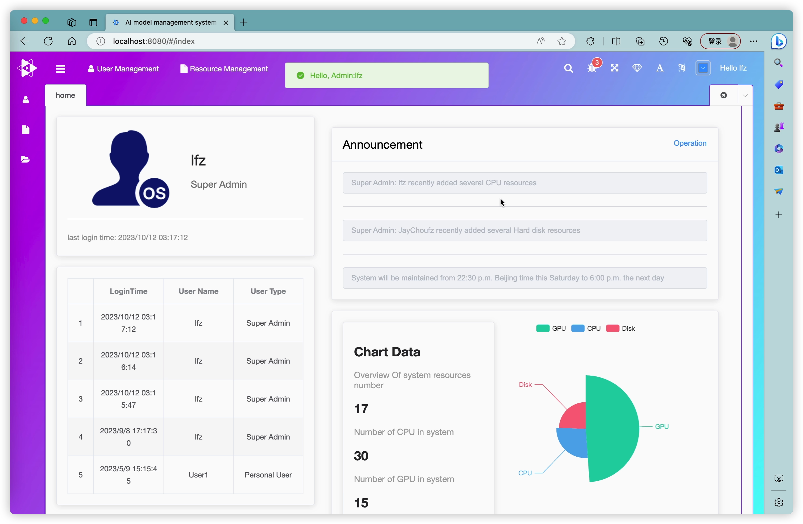

### A Management System 
* two types of roles : 
    * system Admin
    * system Users
* [basic performance show](https://github.com/MysteriousL2019/AI_middle_system/assets/57605362/3ebead97-4bc1-4bd5-bf7b-b3c0b96fe78b)
    

# Roles

## Administrator

### User CRUD

* Create user: Username + password
* Delete user: TODO

### Log Management

* Action monitoring: View actions, such as when a user uploaded data, etc.
* Resource monitoring: Visualize graphs to check resource usage by each user, including GPU, memory, etc.

### Resource Management

* Administrators can increase the cloud service's memory, CPU, and GPU.

## User (Algorithm Engineer)

### Model Management

* Create models: More details on parameters will be provided later.
* Download models: We need to define the format of models in this system. For example, downloading models should be limited to formats like .py, .pickle, etc. The backend will handle this.

### Resource Management

* Data visualization: Implemented through MySQL. The parameters and styling for display need to be designed.
* CRUD: Increase GPU, CPU, memory, etc. - Specific parameters need to be determined.

* Note: There should be integration with the model management section. This means that models created in the model management section can be assigned to already requested GPUs and CPUs. You can refer to the current system for this.

### Data and Dataset Management

* Minio: Object storage database for various file types. Deploy Minio on a server (look into this when time permits).
* Data Management: Use Minio for file management (in practice).
* Dataset Management: Simple CRUD - create datasets (More details on parameters will be provided later).

### Advanced Requirements

If you want to know how to optimize the system for better performance and conduct stress testing, this should be part of the presentation. The demonstration can be done using the pre-designed frontend.

# Inquire About Server Availability

